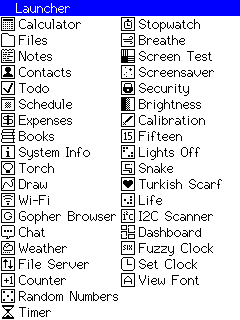

# Description
This is PDA firmware for ESP32 Cheap Yellow Display. Inspired by Palm OS.

PDA is Personal Digital Assistant. Small handheld computer. Like smartphone without phone functions.

# Details
* No additional hardware required. All you need is CYD
* But if you have a speaker it can beep on events
* It uses internal Flash for files storage. FFat as filesystem.
* You can add your own internal apps by modifying arduino code.

# Installation via web flasher
* https://sau412.github.io/esp32_cyd_pda/flash

# Required libraries
* TFT_eSPI - install via arduino library manager
* XPT2046_Touchscreen - install via arduino library manager

# Installation via Arduino IDE
* Install Arduino IDE
* Install Required libraries (see above)
* Replace User_Setup.h with a file from https://github.com/witnessmenow/ESP32-Cheap-Yellow-Display/blob/main/DisplayConfig/User_Setup.h
* Add ESP32 libraries 
* Board Selection: In the Arduino IDE, go to Tools > Board and select ESP32-2432S028R
* Set in Arduino IDE Tools - Partition scheme - No OTA (2 MP APP/2 MB FATFS)
* Compile and upload
* Done

Check instructions at https://randomnerdtutorials.com/cheap-yellow-display-esp32-2432s028r/ if you have troubles.

# First run
* Calibrate sensor screen - calibration data stored in a /Settings/Calibration
* Format internal storage as FFat when asked
* Done

# Usage
* Tap app name to launch this app
* Touch and hold app title more than 1 second to exit app
* Tap buttons in app to perform actions
* For screensavers touch and hold anywhere to exit
* To force perform calibration on start hold touchscreen during reboot
* You can set password in Security app. Password asked when power on. Password stored in a plaintext, no encryption

# Status bar symbols
* W - connected to Wi-Fi
* T - time synced with NTP

# Applications/Functions
* File management (with viewing and editing support)
* Touch sensor calibration
* TFT screen test
* Random number generator
* System info
* Password
* LED control
* Screensaver
* Stopwatch
* Timer
* Breathing timer
* Brightness
* Life (cellular automaton) - see https://en.wikipedia.org/wiki/Conway%27s_Game_of_Life for details
* Clock stand
* Fuzzy clock
* Counter
* I2C Scanner
* Set clock and timezone
* View Fonts
* Make screenshot with BOOT button
* Application groups
* Manual application
* Select color scheme and inversion
* Software reboot app
* Enable/disable russian keyboard app
* Terminal (with serial, ping, telnet)
* Backup via web interface (very slow, ~40 minutes for download, upload is pretty fast)
* Select autorun app

## PIM apps
* Calculator
* Notes
* Books reader
* Contacts
* Todo
* Expenses
* Drawing (with saving BMP)
* Schedule
* Passwords - AES-256 encrypted notes
* Flashcards

## Games
* Fifteen puzzle game - see https://en.wikipedia.org/wiki/15_puzzle for details
* Lights Off puzzle game - see https://en.wikipedia.org/wiki/Lights_Out_(game) for details
* Snake - see https://en.wikipedia.org/wiki/Snake_(video_game_genre) for details
* Turkish Kerchief Solitaire - see https://www.bvssolitaire.com/rules/turkish-kerchief.htm for details
* Memory Match - see https://en.wikipedia.org/wiki/Concentration_(card_game) for details
* Hanoi Towers - see https://en.wikipedia.org/wiki/Tower_of_Hanoi for details
* Match Tree - see https://en.wikipedia.org/wiki/Tile-matching_video_game for details
* Simon - see https://en.wikipedia.org/wiki/Simon_(game) for details
* N back - see https://en.wikipedia.org/wiki/N-back for details
* Mental Math - see https://en.wikipedia.org/wiki/Mental_calculation for details :)

## Wi-Fi
* Wi-Fi connection
* Gopher browser - see https://ru.wikipedia.org/wiki/Gopher for details
* Weather
* Chat - simple chat for CYD PDA users
* File Server (for backups and file upload)
* RSS Reader - see https://en.wikipedia.org/wiki/RSS for details
* IRC client - see https://en.wikipedia.org/wiki/IRC for details

## Sound
* Piano
* Metronome
* Tunes - nokia melody player, try 4g1 8e1 8e1 4g1 8e1 8e1 8c1 8d1 8e1 8f1 2g1 8g1 8g1 8e1 8e1 8f1 8f1 8d1 8d1 4c1 4d1 2c1
* MP3 player
* Web Radio Player

## Terminal commands
* millis - show milliseconds after reboot
* micros - show microseconds after reboot
* date - show current date
* reset - clear screen, reinit terminal
* reboot - reboot CYD
* host - resolve domain name
* ip - show current ip
* gateway - show current gateway
* dns - show current DNS
* netmask - show current netmask
* rssi - show current RSSI value
* ping {host} - ping specified host continiously, touch screen to stop
* serial [speed] - connect to serial port with specified speed, default is 115200
* telnet {host} [port] - connect via telnet to specified host and port
* beep - beep sound
* tone - start sound tone
* notone - stop tone

# Terms of use
You can modify code if you want. Bug reports and pull requests appreciated.

# Links
* Web Flasher: https://sau412.github.io/esp32_cyd_pda/flash
* Video presentation: https://www.youtube.com/watch?v=mXp3R2wKOIw
* Reddit post: https://www.reddit.com/r/esp32projects/comments/1tdrvur/esp32_cyd_pocket_digital_assistant/
* Reddit post: https://www.reddit.com/r/esp32/comments/1teoa28/esp32_cyd_pocket_digital_assistant/
* Reddit post: https://www.reddit.com/r/CheapYellowDisplay/comments/1tdryb3/esp32_cyd_pocket_digital_assistant/
