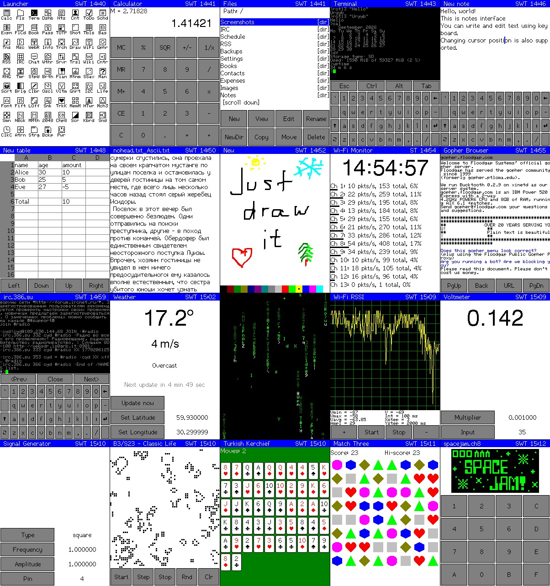

# Description
This is PDA firmware for ESP32 Cheap Yellow Display. Inspired by Palm OS.

PDA is Personal Digital Assistant. Small handheld computer. Like smartphone without phone functions.

# Details
* No additional hardware required. All you need is CYD
* But if you have a speaker it can beep on events.
* It uses internal flash for files storage. FFat as filesystem. You can do backups from FFat to SD.
* Or you can use SD as storage. SD if preferred.
* You can add your own internal apps by modifying arduino code.

# Installation via web flasher
* https://sau412.github.io/esp32_cyd_pda/flash

# Required libraries
* TFT_eSPI - install via arduino library manager
* XPT2046_Bitbang - install via arduino library manager
* ESPping
* Ticker

# Installation via Arduino IDE
* Install Arduino IDE
* Install Required libraries (see above)
* Replace User_Setup.h with a file from https://github.com/witnessmenow/ESP32-Cheap-Yellow-Display/blob/main/DisplayConfig/User_Setup.h
* Add ESP32 libraries
* Board Selection: In the Arduino IDE, go to Tools > Board and select ESP32-2432S028R
* Set in Arduino IDE Tools - Partition scheme - No OTA (2 MP APP/2 MB FATFS)
* Compile and upload
* Done

Check instructions at https://randomnerdtutorials.com/cheap-yellow-display-esp32-2432s028r/ if you have troubles.

# First run
* Calibrate sensor screen - calibration data stored in a /Settings/Calibration
* Format internal storage as FFat when asked
* Done

# Usage
* Tap app name to launch this app
* Touch and hold app title more than 1 second to exit app
* Tap buttons in app to perform actions
* For screensavers touch and hold anywhere to exit
* To force perform calibration on start hold touchscreen during reboot
* You can set password in Security app. Password asked when power on. Password stored in a plaintext, no encryption

# Status bar symbols
* Alarm clock - alarm enabled
* Wi-Fi symbol - connected to Wi-Fi
* Clock with dots - waiting for sync with NTP
* SD card - main storage is SD
* Chip - main storage is FFat (internal storage)
* Note - music playing in progress

# Applications/Functions
* File management (with viewing text, JPEG, PNG and editing text support)
* Touch sensor calibration
* TFT screen test
* Random number generator
* System info
* Password
* LED control
* Stopwatch
* Timer
* Breathing timer
* Life (cellular automaton) - see https://en.wikipedia.org/wiki/Conway%27s_Game_of_Life for details
* Counter
* I2C Scanner
* Make screenshot with BOOT button
* User's manual application
* Terminal (with serial, ping, telnet)
* Backup via web interface (very slow, ~40 minutes for download, upload is pretty fast)
* Oscilloscope
* View Screenshots
* Backup FFat to SD and restore from SD to FFat
* Voltmeter
* Settings app
* Signal generator

## PIM apps
* Calculator
* Notes
* Books reader
* Contacts
* Todo
* Expenses
* Drawing (with saving BMP)
* Schedule
* Passwords - AES-256 encrypted notes
* Flashcards
* Table editor (data stored in CSV format)
* TOTP (like Google Authenticator)
* Basic interpeter - advanced calculations
* Barcode - linear barcode generator (EAN8, EAN13, Code128)

## Games
* Fifteen puzzle game - see https://en.wikipedia.org/wiki/15_puzzle for details
* Lights Off puzzle game - see https://en.wikipedia.org/wiki/Lights_Out_(game) for details
* Snake - see https://en.wikipedia.org/wiki/Snake_(video_game_genre) for details
* Turkish Kerchief Solitaire - see https://www.bvssolitaire.com/rules/turkish-kerchief.htm for details
* Memory Match - see https://en.wikipedia.org/wiki/Concentration_(card_game) for details
* Hanoi Towers - see https://en.wikipedia.org/wiki/Tower_of_Hanoi for details
* Match Tree - see https://en.wikipedia.org/wiki/Tile-matching_video_game for details
* Simon - see https://en.wikipedia.org/wiki/Simon_(game) for details
* N back - see https://en.wikipedia.org/wiki/N-back for details
* Mental Math - see https://en.wikipedia.org/wiki/Mental_calculation for details :)
* 2048 - see https://en.wikipedia.org/wiki/2048_(video_game) for details
* CHIP-8 emulator - see https://en.wikipedia.org/wiki/CHIP-8 for details
* Sokoban - see https://en.wikipedia.org/wiki/Sokoban for details
* Minesweeper - see https://en.wikipedia.org/wiki/Minesweeper_(video_game) for details
* Chessboard - chessboard with chess figures. No rules.

## Dashboards
* Clock and Calendar
* Fuzzy Clock
* Unix Time
* Internet Time
* Analog Time
* Weather
* Network
* Wi-Fi Channels Monitor
* World Time
* Bitcoin block, price, pending transactions
* Random Useless Fact

## Screensavers
* Stars
* Color squares
* Lorenz attractor
* Noise
* Matrix
* Forest Fire Simulator
* Mood Lamp
* Through the Universe

## Wi-Fi
* Wi-Fi connection
* Gopher browser - see https://ru.wikipedia.org/wiki/Gopher for details
* Weather
* Chat - simple chat for CYD PDA users
* File Server (for backups and file upload)
* RSS Reader - see https://en.wikipedia.org/wiki/RSS for details
* IRC client - see https://en.wikipedia.org/wiki/IRC for details
* Translate (via google translate unofficial API)
* Wikipedia article reader

## Sound
* Piano
* Metronome
* Tunes - nokia melody player, try 4g1 8e1 8e1 4g1 8e1 8e1 8c1 8d1 8e1 8f1 2g1 8g1 8g1 8e1 8e1 8f1 8f1 8d1 8d1 4c1 4d1 2c1
* MP3 player
* Web Radio Player

## Terminal commands
* millis - show milliseconds after reboot
* micros - show microseconds after reboot
* date - show current date
* reset - clear screen, reinit terminal
* reboot - reboot CYD
* host - resolve domain name
* ipconfig - show all network information
* ip - show current ip
* gateway - show current gateway
* dns - show current DNS
* netmask - show current netmask
* rssi - show current RSSI value
* hostname {hostname} - set hostname
* ping {host} - ping specified host continiously, touch screen to stop
* serial [speed] - connect to serial port with specified speed, default is 115200
* telnet {host} [port] - connect via telnet to specified host and port
* telnets {host} [port] - connect via telnet to specified host and port using SSL
* wget {url} [filename] - download file with http/https and show or store to file
* tracert {host} - traceroute ho host
* ipinfo {ip} - show IP information (via ipinfo.io)
* translate {from} {to} {text} - translate with Google Translate
* weather [lat] [lon] - show weather in specific location
* chat [{nick} {message}] - show chat or send message to chat
* sd_to_ffat {sd_path} {ffat_path} - copy file from SD to FFat
* ffat_to_sd {ffat_path} {sd_path} - copy file from FFat to SD
* utf8_to_cp1251 {from_file} {to_file} - convert file encoding from UTF-8 to CP1251
* beep - beep sound
* tone - start sound tone
* notone - stop tone
* hexdump {path} - view files in hex codes
* uuidgen - generate uuid
* uptime - shows uptime in days, hours, minutes, seconds
* tracert {host} - traceroute host
* random [from] [to] - random number
* cd {path} - change directory
* pwd - show current directory
* mkdir {path} - create directory
* rmdir {path} - remove empty directory
* rm {path} - remove file
* file {path} - show file type
* touch {path} - create empty file
* ls {path} - list directory files
* cat {path} - show file contents
* more {path} - show file page by page
* head {path} - show beginning of the file
* tail {path} - show ending of the file
* grep {text} {path} - find lines with text
* hexdump {path} - view file in hex
* append {path} {text} - append text to file
* crc {path} - calculate CRC of file
* md5sum {path} - calculate MD5 of file
* sha256sum {path} - calculate SHA256 of file
* brainfuck {path} - run brainfuck code from file
* touch {path} - create file
* basic {path} - run BASIC code from file
* echo {text} - show text and exit
* caesar {text} - encodes text with Caesar encryption, https://en.wikipedia.org/wiki/Caesar_cipher
* seq {from} {to} - generate number sequence
* wc {path} - calculate words, lines and bytes in file
* lscpu - information about CPU
* lsmem - information about memory
* lsblk - information about internal storage
* ffat_to_sd {path} {path} - copy between storages
* sd_to_ffat {path} {path} - copy between storages
* view {path} - view file (GUI viewer)
* hexview {path} - view file in hex (GUI viewer)
* edit {path} - edit file (GUI editor)
* csv {path} - edit file in table editor
* utf8_to_cp1251 {path} {path} - change enconding from utf-8 to cp1251
* cp1251_to_utf8 {path} {path} - change enconding from cp1251 to utf-8
* base16encode {path} [path] - encode file to base16
* base16decode {path} [path] - decode file from base16
* base32encode {path} [path] - encode file to base32
* base32decode {path} [path] - decode file from base32
* base64encode {path} [path] - encode file to base64
* base64decode {path} [path] - decode file from base64
* aes_encrypt {password} {path} [path] - encrypt file with AES-256
* aes_decrypt {password} {path} [path] - decrypt file with AES-256
* app {app_name} - launch app by name
* Filename from /Terminal - run commands from file one-by-one

# Terms of use
You can modify code if you want. Bug reports and pull requests appreciated.

# Links
* Web Flasher: https://sau412.github.io/esp32_cyd_pda/flash
* Video presentation: https://www.youtube.com/watch?v=mXp3R2wKOIw
* Reddit post: https://www.reddit.com/r/esp32projects/comments/1tdrvur/esp32_cyd_pocket_digital_assistant/
* Reddit post: https://www.reddit.com/r/esp32/comments/1teoa28/esp32_cyd_pocket_digital_assistant/
* Reddit post: https://www.reddit.com/r/CheapYellowDisplay/comments/1tdryb3/esp32_cyd_pocket_digital_assistant/
