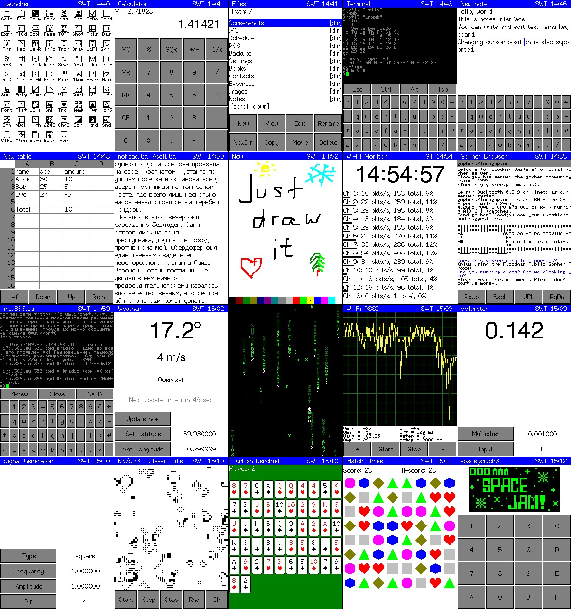

# Description
This is PDA firmware for ESP32 Cheap Yellow Display. Inspired by Palm OS.

PDA is Personal Digital Assistant. Small handheld computer. Like smartphone without phone functions.

# Details
* No additional hardware required. All you need is CYD
* But if you have a speaker it can beep on events.
* It uses internal flash for files storage. FFat as filesystem. You can do backups from FFat to SD.
* Or you can use SD as storage. SD if preferred.
* You can add your own internal apps by modifying arduino code.

# Installation via web flasher
* https://sau412.github.io/esp32_cyd_pda/flash

# Required libraries
* TFT_eSPI - install via arduino library manager
* XPT2046_Bitbang - install via arduino library manager
* ESPping
* Ticker

# Installation via Arduino IDE
* Install Arduino IDE
* Install Required libraries (see above)
* Replace User_Setup.h with a file from https://github.com/witnessmenow/ESP32-Cheap-Yellow-Display/blob/main/DisplayConfig/User_Setup.h
* Add ESP32 libraries
* Board Selection: In the Arduino IDE, go to Tools > Board and select ESP32-2432S028R
* Set in Arduino IDE Tools - Partition scheme - No OTA (2 MP APP/2 MB FATFS)
* Compile and upload
* Done

Check instructions at https://randomnerdtutorials.com/cheap-yellow-display-esp32-2432s028r/ if you have troubles.

# First run
* Calibrate sensor screen - calibration data stored in a /Settings/Calibration
* Format internal storage as FFat when asked
* Done

# Usage
* Tap app name to launch this app
* Touch and hold app title more than 1 second to exit app
* Tap buttons in app to perform actions
* For screensavers touch and hold anywhere to exit
* To force perform calibration on start hold touchscreen during reboot
* You can set password in Security app. Password asked when power on. Password stored in a plaintext, no encryption

# Status bar symbols
* Alarm clock - alarm enabled
* Wi-Fi symbol - connected to Wi-Fi
* Clock with dots - waiting for sync with NTP
* SD card - main storage is SD
* Chip - main storage is FFat (internal storage)
* Note - music playing in progress

# Applications/Functions
* File management (with viewing text, JPEG, PNG and editing text support)
* Touch sensor calibration
* TFT screen test
* Random number generator
* System info
* Password
* LED control
* Stopwatch
* Timer
* Breathing timer
* Life (cellular automaton) - see https://en.wikipedia.org/wiki/Conway%27s_Game_of_Life for details
* Counter
* I2C Scanner
* Make screenshot with BOOT button
* User's manual application
* Terminal (with serial, ping, telnet)
* Backup via web interface (very slow, ~40 minutes for download, upload is pretty fast)
* Oscilloscope
* View Screenshots
* Backup FFat to SD and restore from SD to FFat
* Voltmeter
* Settings app
* Signal generator
* L system fractal generator - see https://en.wikipedia.org/wiki/L-system for details

## PIM apps
* Calculator
* Notes
* Books reader
* Contacts
* Todo
* Expenses
* Drawing (with saving BMP)
* Schedule
* Passwords - AES-256 encrypted notes
* Flashcards
* Table editor (data stored in CSV format)
* TOTP (like Google Authenticator)
* Basic interpeter - advanced calculations
* Barcode - linear barcode generator (EAN8, EAN13, Code128)

## Games
* Fifteen puzzle game - see https://en.wikipedia.org/wiki/15_puzzle for details
* Lights Off puzzle game - see https://en.wikipedia.org/wiki/Lights_Out_(game) for details
* Snake - see https://en.wikipedia.org/wiki/Snake_(video_game_genre) for details
* Turkish Kerchief Solitaire - see https://www.bvssolitaire.com/rules/turkish-kerchief.htm for details
* Memory Match - see https://en.wikipedia.org/wiki/Concentration_(card_game) for details
* Hanoi Towers - see https://en.wikipedia.org/wiki/Tower_of_Hanoi for details
* Match Tree - see https://en.wikipedia.org/wiki/Tile-matching_video_game for details
* Simon - see https://en.wikipedia.org/wiki/Simon_(game) for details
* N back - see https://en.wikipedia.org/wiki/N-back for details
* Mental Math - see https://en.wikipedia.org/wiki/Mental_calculation for details :)
* 2048 - see https://en.wikipedia.org/wiki/2048_(video_game) for details
* CHIP-8 emulator - see https://en.wikipedia.org/wiki/CHIP-8 for details
* Sokoban - see https://en.wikipedia.org/wiki/Sokoban for details
* Minesweeper - see https://en.wikipedia.org/wiki/Minesweeper_(video_game) for details
* Chessboard - chessboard with chess figures. No rules.
* Tetris - see https://en.wikipedia.org/wiki/Tetris for details

## Dashboards
* Clock and Calendar - shows clock and calendar
* Fuzzy Clock - shows time with 5 minutes precision
* Unix Time - shows unix time
* Internet Time - shows @beats time
* Analog Time - shows analog clock
* Weather - show current weather
* Network - ping different continents
* Wi-Fi Channels Monitor - monitor Wi-Fi channels usage
* World Time - time in different cities
* Bitcoin block, price, pending transactions
* Random Useless Fact
* HF Propagation - HF propagation from hamqsl.com
* Intervals - time from and to events, like birthdays or new year
* Morse News - beep news titles with morse each five minutes

## Screensavers
* Stars
* Color squares
* Lorenz attractor
* Noise
* Matrix
* Forest Fire Simulator
* Mood Lamp
* Through the Universe

## Wi-Fi
* Wi-Fi connection
* Gopher browser - see https://ru.wikipedia.org/wiki/Gopher for details
* Weather
* Chat - simple chat for CYD PDA users
* File Server (for backups and file upload)
* RSS Reader - see https://en.wikipedia.org/wiki/RSS for details
* IRC client - see https://en.wikipedia.org/wiki/IRC for details
* Translate (via google translate unofficial API)
* Wikipedia article reader

## Sound
* Piano
* Metronome
* Tunes - nokia melody player, try 4g1 8e1 8e1 4g1 8e1 8e1 8c1 8d1 8e1 8f1 2g1 8g1 8g1 8e1 8e1 8f1 8f1 8d1 8d1 4c1 4d1 2c1
* MP3 player
* Web Radio Player

## Terminal commands
* Filename from /Terminal - run commands from file one-by-one
* String starting with # is a comment

Internal operations:
* reboot - reboot device
* exit - exit terminal app
* gamma {value 1-4} - set gamma correction by index

Date and time:
* millis - milliseconds after boot
* micros - microseconds after boot
* uptime - human-readable uptime
* date - current date
* utc - current time in UTC
* unixtime - current unix timestamp
* ticks - current time in .NET ticks
* beats - current time in @beats
* cal - show current month
* settime {hour} {minute} {second} - set clock
* setdate {date} - set date
* setdatetime {datetime} - set clock and date
* sun - sun information
* moon - moon information
* date_add {date|datetime} {interval} {unit} - add interval to date
* date_sub {date|datetime} {interval} {unit} - substract interval from date
* interval {from_date|from_datetime} [to_date|to_datetime] - interval between dates

Terminal controls:
* clear - clear screen
* reset - reset terminal (apply default settings)
* cursor {col} {row} - set cursor position
* history - show command history
* rpt - repeat last command (except rpt)
* echo {text} - show text
* cowsay {text} - show text with a cow
* caesar {text} - encode text with Caesar code
* rot13 {text} - encode text with rot13
* seq {start_number} {end_number} - sequental numbers
* lscpu - show CPU information
* uname - show firmware information
* lsmem - show RAM information
* lsblk - show internal storage information
* colors - show terminal colors
* sleep {seconds} - sleep for specific time in seconds
* delay {milliseconds} - sleep for specific time in milliseconds
* serial [-tx pin] [-rx pin] [speed] - connect to serial port

Random numbers:
* random [from] [to] - generate random numbers (from and to included)
* uuidgen - generate random UUID

Converters:
* ip2long {IP} - IP to number
* long2ip {number} - number to IP
* bin {binary} - binary number to octal, decimal, hexadecimal
* binoct {binary} - binary to octal
* bindec {binary} - binary to decimal
* binhex {binary} - binary to hexadecimal
* oct {octal} - octal to binary, decimal, hexadecimal
* octbin {octal} - octal to binary
* octdec {octal} - octal to decimal
* octhex {octal} - octal to hexadecimal
* dec {decimal} - decimal to binary, octal, hexadecimal
* decbin {decimal} - decimal to binary
* decoct {decimal} - decimal to octal
* dechex {decimal} - decimal to hexadecimal
* hex {hexadecimal} - hexadecimal to binary, octal, decimal
* hexbin {hexadecimal} - hexadecimal to binary
* hexoct {hexadecimal} - hexadecimal to octal
* hexdec {hexadecimal} - hexadecimal to decimal
* qth - ham QTH locator

Math and statistics:
* bc {expression} - calculate expressions
* gcd {number} {number} - greatest common divider
* nod {number} {number} - same as gcd 
* lcm {number} {number} - least common multiple
* nok {number} {number} - same as lcm
* factorial {number} - factorial of number
* dividers {number} - dividers of number
* factorize {number} - factorize number
* stat {number} [number ...] - statistics of input data
* det {{a11} {a12} {a21} {a22}|{a11} {a12} {a13} {a21} {a22} {a23} {a31} {a32} {a33}} - determinant of matrix 2x2 or 3x3
* reverse {number} - reverse digits in number (in decimal)
* digit_sum {number} - sum of digits (in decimal)
* bitset {number} {bit_number} - set single bit
* bitget {number} {bit_number} - get single bit
* bitclear {number} {bit_number} - clear single bit
* bittoggle {number} {bit_number} - toggle single bit
* rol {number} - rotate binary left
* ror {number} - rotate binary right
* clz {number} - count leading zeroes (in binary)
* ctz {number} - count tailing zeroes (in binary)
* popcount {number} - number of set bits (in binary)
* parity {number} - is number of bits odd (in binary)
* div {number1} {number2} - divide by module
* permutation  {number} - permutations count
* arrangement {of_n} {taken_k} - arrangements count
* combination {of_n} {taken_k} - combinations count
* subnet {subnet}/{netmask} - subnet calculator

Storage settings:
* storage {ffat|sd|none} - set storage
* df - show current storage stats
* format {ffat} - format (ffat only)
* erase {ffat} - erase ffat flash

File operations:
* stack - show file /Terminal/Stack
* push {text} - push line to /Terminal/Stack
* pop - pop line from /Terminal/Stack
* unshift {text} - unshift line to /Terminal/Stack
* shift - shift line from /Terminal/Stack
* cd [directory] - change directory
* pwd - chow current directory
* ls [directory] - list files in current directory
* mkdir {directory} - create directory
* rmdir {directory} - remove directory
* cp {from_path} {to_path} - copy files recursively
* mv {from_path} {to_path} - move files recursively
* rm {from_path} - remove files recursively
* file {file_path} - show file type by file contents
* cat {file_path} - show file contents
* head {file_path} - show starting lines of file
* tail {file_path} - show tailing lines of file
* more {file_path} - show file screen by screen
* grep {text} {file_path} - grep lines from file
* view {file_path} - view file in GUI viewer
* hexview {file_path} - view file in hex in GUI viewer
* append {file} {line} [line] … - add lines to file
* edit {file_path} - edit text file in GUI editor
* csv {file_path} - edic CSV file in GUI editor
* hexdump {file_path} - show file in hex (in console)
* wc {file_path} - calculate chars, words, lines
* crc {file_path} - calculate CRC checksum
* md5sum {file_path} - calculate MD5 schecksum
* sha256sum {file_path} - calculate SHA256 checksum
* brainfuck {file_path} - brainfuck interpreter
* basic {file_path} - BASIC interpreter
* touch {file_path} - crete empty file
* ffat_to_sd {ffat_filename} {sd_filename} - copy file from ffat to SD
* sd_to_ffat {sd_filename} {ffat_filename} - copy file from SD to ffat
* utf8_to_cp1251 {input_filename} {output_filename} - change file encoding from UTF-8 to cp1251
* cp1251_to_utf8 {input_filename} {output_filename} - change file encoding from cp1251 to UTF-8
* base16encode {input_filename} [output_filename] - encode file with base16
* base16decode {input_filename} [output_filename] - decode file from base16
* base32encode {input_filename} [output_filename] - encode file with base32
* base32decode {input_filename} [output_filename] - decode file from base32
* base64encode {input_filename} [output_filename] - encode file with base64
* base64decode {input_filename} [output_filename] - decode file from base64
* aes_encrypt {password} {input_filename} [output_filename] - encrypt file with AES256
* aes_decrypt {password} {input_filename} [output_filename] - decrypt file from AES256
* sizeof - show size of internal data types

I2C and other protocols:
* i2c - I2C scanner

Sound:
* beep - beep once
* notone - stop sound
* tone {freq} - start sound tone
* morse {text} - beep text with morse code

Networking:
* ifconfig - show network configuration
* ipconfig - same as ifconfig
* hostname [new_hostname] - show and set current hostname
* ip - current ip
* netmask - current netmask
* gateway - current gateway
* dns - current DNS
* rssi - current RSSI
* host - resovle host with DNS
* arp - show ARP
* arpscan - scan subnet with ARP
* ping {hostname} - ping host
* pingscan {subnet}/{netmask} - scan subnet with ping
* tcpscan {host} [port_from] [port_to] - scan host ports with TCP
* tracert {hostname} - traceroute
* telnet {host} [port] - telnet client
* telnets {host} [port] - telnet client with SSL
* wget {URL} [filename] - download file
* ipinfo {ip} - fhow ipinfo via ipinfo.io
* hamqsl - show hf propagation
* bitcoin - show current bitcoin info
* myextip - show current external IP
* translate {lang_from|auto} {lang_to} {query} - translate with google translate
* weather [lat] [lon] - current weather
* chat [{nick} {message}]- chat read and post
* ruf - random useless fact
* iperf {host} [port] - iperf 2 client
* help - show current help
* app {app_name} - run GUI app with app name

app arguments:
* calculator
* files
* notes
* contacts
* todo
* schedule
* expenses
* flashcards
* books
* passwords
* totp
* barcode
* tables
* screenshots
* tunes
* music
* webradio
* system_info
* torch
* draw
* wifi
* gopher
* rss
* irc
* chat
* weather
* file_server
* translate
* wikipedia
* counter
* random_numbers
* timer
* stopwatch
* breathe
* piano
* metronome
* screensaver
* user_manual
* security
* brightness
* touch_calibration
* touch_calibration_3point
* touch_calibration_multipoint
* oscilloscope
* voltmeter
* generator
* life
* l_system
* dashboard
* fuzzy_clock
* view_font
* fifteen
* lights_off
* snake
* turkish_kerchief
* memory_match
* hanoi_towers
* match_three
* simon
* n_back
* mental_math
* game2048
* minesweeper
* chess
* tetris
* sokoban
* screen_settings
* keyboard_control
* sound_control
* set_clock
* autorun
* select_storage
* backups
* search
* random

# Terms of use
You can modify code if you want. Bug reports and pull requests appreciated.

# Links
* Web Flasher: https://sau412.github.io/esp32_cyd_pda/flash
* Video presentation (old): https://www.youtube.com/watch?v=mXp3R2wKOIw
* Telegram group: https://t.me/arikado_chat_ru/9896
* First article! https://hackaday.com/2026/09/26/cheap-yellow-display-dreams-of-pda/
